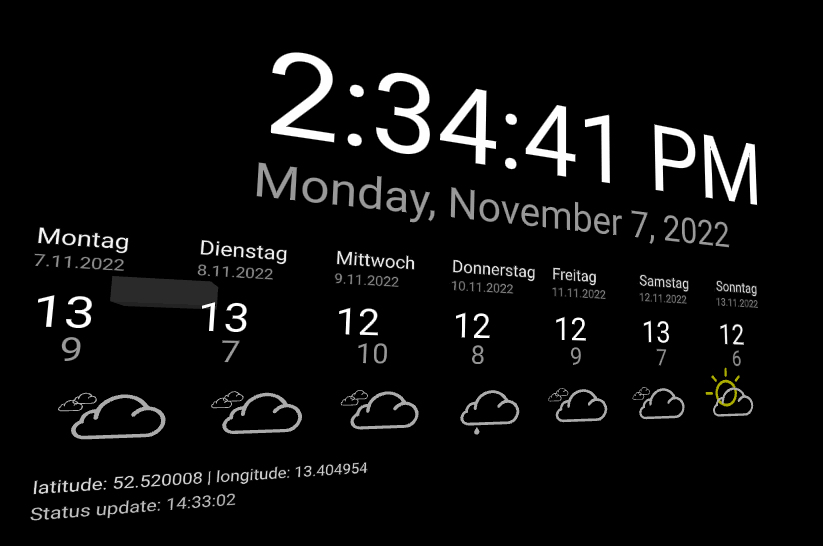
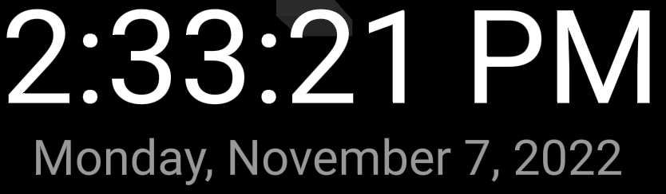
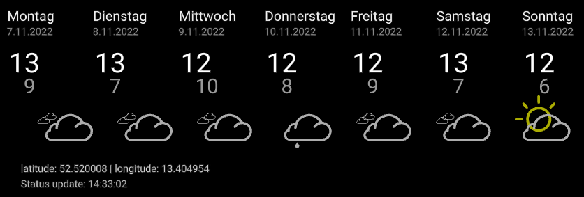
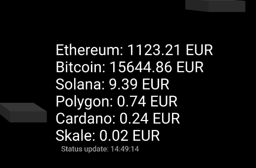

# A-Frame ready to use XR components
All Components written to be easy usable in all kinds of XR expiriences.
They are base on the A-Frame Component System described here https://aframe.io/docs/1.3.0/introduction/writing-a-component.html

## Overview
Component showcase animation gif.

## Components

### Clock Component
Simple Clock object with time and date, using local settings for time and date strings

[more Details here](docs/clock-component.md)

### Weather Component
Local Weather display based on GPS longitude and latitude using a free service API from https://www.7timer.info

[more Details here](docs/weather-component.md)

### Crypto Currency Component
Displays currenet Crypto Currency exchange rates using a free service API from https://docs.cloud.coinbase.com/sign-in-with-coinbase/docs/api-exchange-rates#http-request

[more Details here](docs/crypto-info-component.md)

### more Components
soon more here ...
