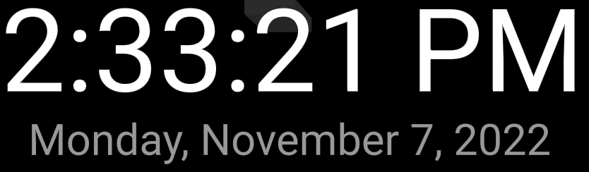

# Clock Component

## Overview
Simple Clock object with time and date, using local settings for time and date strings.

## Component Interface
The Clock Component can be configured to use local browser Settings, in case nothing is specified the default is used. (en-US)

        <!-- Clock showcase -->
        <a-entity clock-component="local:en-US" position="-2.2 1 -1.5"></a-entity>

## Details
The component is refreshing the Time and Date on every a-frame component tick.