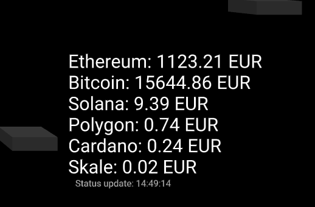

# Crypto Info Component

## Overview
Displays current Crypto Currency exchange rates.

## Component Interface
This Crypto Component can be configured to use any target currency, in case nothing is specified the default is used. (USD)

        <!-- Crypto Currency Info showcase -->
        <a-entity crypto-info-component="currency:EUR" position="4 -2 -5"></a-entity>

## API
following REST API call is executed all ~15 minutes to refresh the currency status from this fee API (no API key needed)

        https://api.coinbase.com/v2/exchange-rates?currency=USD

Sample Result:

        {"data":{"currency":"EUR","rates":{"AED":"3.90788","AFN":"94.2399999999998372","ALL":"112.982","AMD":"418.7199999999963287" ....

> full Coinbase API Docs here: https://docs.cloud.coinbase.com/sign-in-with-coinbase/docs/api-exchange-rates#http-request 