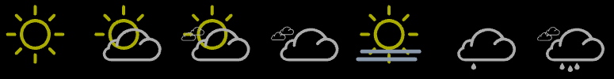
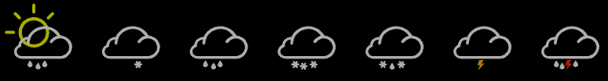

# Weather Component

## Overview
Local Weather display based on GPS longitude and latitude using a free service API from https://www.7timer.info

## Component Interface
The Weather Component can be configured via W3C GPS or GEO IP longitude and latitude, in case nothing is configured the default of the component is used (center of Berlin in Germany)

        <!-- Weather showcase -->
        <a-entity weather-component="lon:13.404954; lat:52.520008" position="-4 -0.4 -5"></a-entity>

## 3D Objects
used GLB Objects free to use, and available a Blender project file as well.

 [Weather Icons Blender Project File download](https://github.com/JGrotex/aframe/raw/main/src/glb/weather/weather-icons.blend)

## API
following REST API call is executed all ~30 minutes to refresh the weather status from this fee API (no API key needed)

        https://www.7timer.info/bin/api.pl?lon=13.404954&lat=52.520008&product=civillight&output=json

Sample Result:

        { "product" : "civillight" , "init" : "2022110800" , "dataseries" : [ { "date" : 20221108, "weather" : "cloudy", "temp2m" : { "max" : 14, "min" : 8 }, "wind10m_max" : 3 }, { "date" : 20221109, "weather" : "cloudy", "temp2m" : { "max" : 14, "min" : 10 }, "wind10m_max" : 3 }, { "date" : 20221110, "weather" : "mcloudy", "temp2m" : { "max" : 11, "min" : 7 }, "wind10m_max" : 3 }, { "date" : 20221111, "weather" : "cloudy", "temp2m" : { "max" : 13, "min" : 7 }, "wind10m_max" : 3 }, { "date" : 20221112, "weather" : "cloudy", "temp2m" : { "max" : 13, "min" : 7 }, "wind10m_max" : 2 }, { "date" : 20221113, "weather" : "cloudy", "temp2m" : { "max" : 12, "min" : 6 }, "wind10m_max" : 2 }, { "date" : 20221114, "weather" : "mcloudy", "temp2m" : { "max" : 12, "min" : 5 }, "wind10m_max" : 2 } ] }

> full 7timer API Docs here: https://github.com/Yeqzids/7timer-issues/wiki/Wiki#civil-and-civil-light 